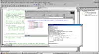



## GoXML

### Description

GoXML is a wrapper class for MSXML 2.0 / 2.6 / 3.0 / 4.0,

offering access to some of the more basic elements in

your xml documents.

Use GoXML and easy-to-learn XPath to open, create, modify

and save XML documents without a hassle.

Don't worry about available MS XML Parser version, GoXML will autodetect it for you!

The included code sample illustrates the use of all methods and properties.

PLEASE VOTE OR COMMENT, THANKS!
 
### More Info
 

             |
---                |---
**Submitted On**   |2002-05-30 01:12:32
**By**             |[Roman Kehr](https://github.com/Planet-Source-Code/PSCIndex/blob/master/ByAuthor/roman-kehr.md)
**Level**          |Intermediate
**User Rating**    |4.8 (145 globes from 30 users)
**Compatibility**  |VB 5\.0, VB 6\.0, VB Script, ASP \(Active Server Pages\) , VBA MS Access, VBA MS Excel
**Category**       |[Databases/ Data Access/ DAO/ ADO](https://github.com/Planet-Source-Code/PSCIndex/blob/master/ByCategory/databases-data-access-dao-ado__1-6.md)
**World**          |[Visual Basic](https://github.com/Planet-Source-Code/PSCIndex/blob/master/ByWorld/visual-basic.md)
**Archive File**   |[GoXML882595292002\.zip](https://github.com/Planet-Source-Code/roman-kehr-goxml__1-29688/archive/master.zip)

